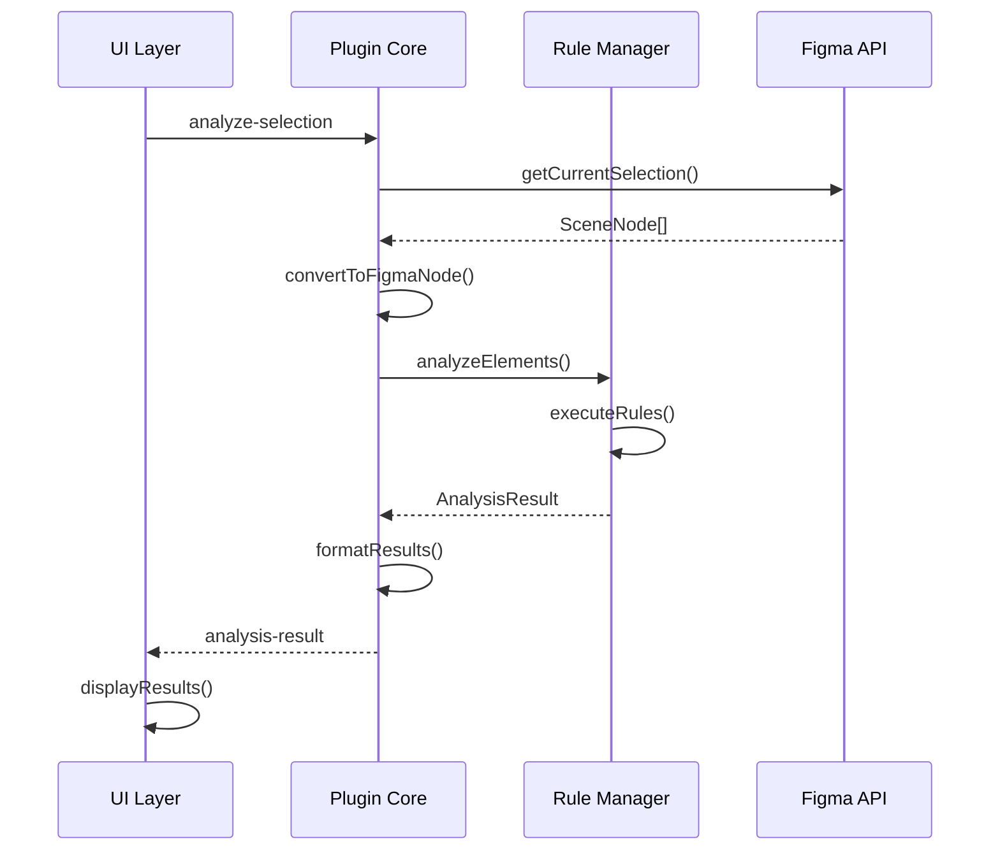
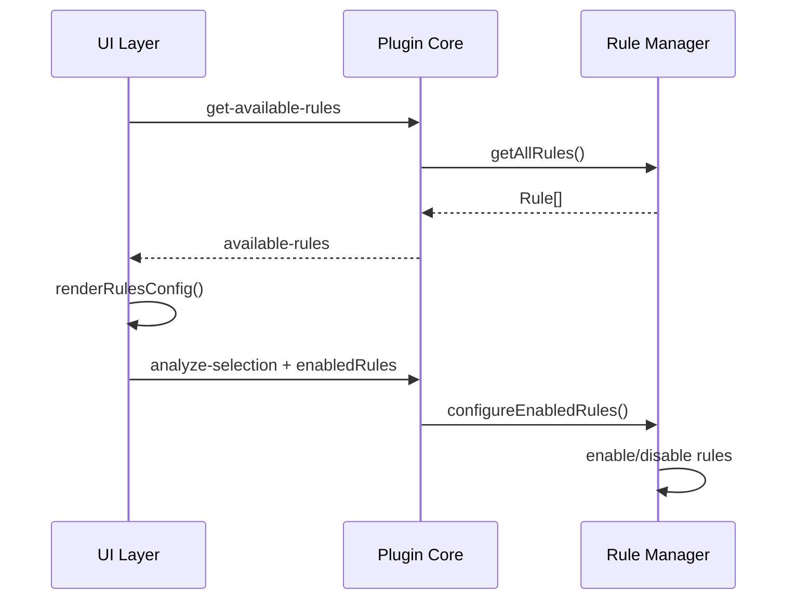

# Documentación Técnica

Esta documentación describe la arquitectura técnica, APIs y detalles de implementación del UX Smells Detector.

## 🏗️ Arquitectura del Sistema

### Visión General
El plugin sigue una arquitectura modular con separación clara entre la lógica de negocio, la interfaz de usuario y la integración con Figma.

```
┌─────────────────┐    ┌─────────────────┐    ┌─────────────────┐
│   Figma API     │◄──►│  Plugin Core    │◄──►│   UI Layer      │
│                 │    │                 │    │                 │
│ - Node Access   │    │ - Rule Manager  │    │ - React/HTML    │
│ - Selection     │    │ - Analysis      │    │ - Event Handling│
│ - Viewport      │    │ - Data Models   │    │ - State Mgmt    │
└─────────────────┘    └─────────────────┘    └─────────────────┘
```

### Componentes Principales

#### 1. Plugin Core (`src/code/`)
- **Responsabilidad**: Lógica principal del plugin, comunicación con Figma API
- **Archivos principales**:
  - `index.ts`: Punto de entrada, manejo de mensajes
  - `figma-adapter.ts`: Adaptador para la API de Figma

#### 2. Rule Engine (`src/models/`)
- **Responsabilidad**: Sistema de reglas de detección de UX smells
- **Archivos principales**:
  - `rule-manager.ts`: Gestor principal de reglas
  - `rule-structure.ts`: Definiciones y utilidades de reglas
  - `basic-rules.ts`: Implementación de reglas básicas

#### 3. UI Layer (`src/ui/`)
- **Responsabilidad**: Interfaz de usuario del plugin
- **Archivos principales**:
  - `index.ts`: Lógica de la interfaz
  - `ui.html`: Estructura HTML
  - `styles.css`: Estilos CSS

#### 4. Type Definitions (`src/types/`)
- **Responsabilidad**: Definiciones de tipos TypeScript
- **Archivos principales**:
  - `index.ts`: Tipos principales del sistema

## 🔧 APIs y Interfaces

### Plugin Core API

#### Mensajes del Plugin
```typescript
interface PluginMessage {
  type: 'analyze-selection' | 'analyze-page' | 'select-element' | 'get-available-rules';
  data?: any;
  enabledRules?: string[];
  elementId?: string;
}
```

#### Respuestas del Plugin
```typescript
interface PluginResponse {
  type: 'analysis-result' | 'available-rules';
  data: AnalysisResult | Rule[];
}
```

### Rule Engine API

#### Interfaz de Regla
```typescript
interface BasicRule {
  id: string;
  name: string;
  description: string;
  category: IssueCategory;
  severity: SeverityLevel;
  enabled: boolean;
  detectionFunction: DetectionFunction;
  fixFunction?: FixFunction;
  configuration?: RuleConfiguration;
}
```

#### Función de Detección
```typescript
type DetectionFunction = (
  element: FigmaNode, 
  context: RuleContext
) => DetectionResult;

interface DetectionResult {
  detected: boolean;
  confidence: number; // 0-1
  evidence: Evidence[];
  suggestions: string[];
}
```

#### Gestor de Reglas
```typescript
class RuleManager {
  // Gestión de reglas
  addRule(rule: BasicRule): ValidationResult;
  removeRule(ruleId: string): boolean;
  enableRule(ruleId: string): boolean;
  disableRule(ruleId: string): boolean;
  
  // Análisis
  analyzeElement(element: FigmaNode, context: RuleContext): AnalysisResult;
  analyzeElements(elements: FigmaNode[]): BatchAnalysisResult;
  
  // Configuración
  exportConfiguration(): RuleManagerConfiguration;
  importConfiguration(config: RuleManagerConfiguration): boolean;
}
```

### UI API

#### Gestión de Estado
```typescript
interface UIState {
  lastAnalysisResults: AnalysisResult | null;
  currentPage: number;
  showAllIssues: boolean;
  availableRules: Rule[];
  selectedRules: Set<string>;
}
```

#### Event Handlers
```typescript
// Análisis
function handleAnalyzeSelection(): void;
function handleAnalyzePage(): void;

// Navegación
function goToPage(page: number): void;
function toggleShowAll(): void;
function selectElement(elementId: string): void;

// Configuración de reglas
function initializeRules(rules: Rule[]): void;
function updateRulesUI(): void;
```

## 📊 Modelos de Datos

### Elemento de Figma
```typescript
interface FigmaNode {
  id: string;
  name: string;
  type: string;
  visible?: boolean;
  x?: number;
  y?: number;
  width?: number;
  height?: number;
  characters?: string;
  fontSize?: number;
  fontName?: FontName;
  fills?: Paint[];
  // ... más propiedades
}
```

### Problema de Usabilidad
```typescript
interface UsabilityIssue {
  id: string;
  elementId: string;
  category: IssueCategory;
  severity: SeverityLevel;
  description: string;
  ruleId: string;
  elementInfo?: {
    name: string;
    type: string;
    position?: { x: number; y: number };
    size?: { width: number; height: number };
    textContent?: string;
    hierarchy?: string[];
  };
  details?: {
    expectedValue?: any;
    actualValue?: any;
    autoFixable?: boolean;
  };
}
```

### Resultado de Análisis
```typescript
interface AnalysisResult {
  id: string;
  timestamp: Date;
  issues: UsabilityIssue[];
  recommendations: Recommendation[];
  metrics: AnalysisMetrics;
  context: AnalysisContext;
}

interface AnalysisMetrics {
  totalIssues: number;
  issuesByCategory: Record<IssueCategory, number>;
  issuesBySeverity: Record<SeverityLevel, number>;
  averageSeverity: number;
  elementsAnalyzed: number;
  analysisTime: number;
}
```

## 🔄 Flujo de Datos

### Análisis de Elementos


### Configuración de Reglas


## 🧪 Testing

### Estructura de Tests
```
tests/
├── unit/
│   ├── models/
│   │   ├── rule-manager.test.ts
│   │   ├── basic-rules.test.ts
│   │   └── rule-structure.test.ts
│   ├── ui/
│   │   └── index.test.ts
│   └── code/
│       └── index.test.ts
├── integration/
│   ├── analysis-flow.test.ts
│   └── rule-configuration.test.ts
└── e2e/
    └── plugin-workflow.test.ts
```

### Mocking de Figma API
```typescript
// Mock para testing
const mockFigma = {
  currentPage: {
    selection: [],
    children: []
  },
  getNodeById: jest.fn(),
  notify: jest.fn(),
  ui: {
    postMessage: jest.fn(),
    onmessage: null
  }
};

global.figma = mockFigma;
```

### Tests de Reglas
```typescript
describe('ContrastRule', () => {
  it('should detect low contrast text', () => {
    const element = createMockTextElement({
      fills: [{ color: { r: 0.8, g: 0.8, b: 0.8 } }], // Light gray
      background: { color: { r: 1, g: 1, b: 1 } } // White
    });
    
    const result = contrastRule.detectionFunction(element, mockContext);
    
    expect(result.detected).toBe(true);
    expect(result.confidence).toBeGreaterThan(0.8);
  });
});
```

## 🚀 Build y Deployment

### Build Process
```bash
# Desarrollo
npm run dev          # Build con watch mode
npm run dev:ui       # Solo UI con hot reload
npm run dev:code     # Solo plugin core

# Producción
npm run build        # Build optimizado
npm run build:clean  # Limpiar y build
npm run analyze      # Análisis del bundle
```

### Webpack Configuration
```javascript
module.exports = {
  entry: {
    ui: './src/ui/index.ts',
    code: './src/code/index.ts'
  },
  output: {
    path: path.resolve(__dirname, 'dist'),
    filename: '[name].js'
  },
  resolve: {
    extensions: ['.ts', '.tsx', '.js']
  },
  module: {
    rules: [
      {
        test: /\.tsx?$/,
        use: 'ts-loader',
        exclude: /node_modules/
      }
    ]
  }
};
```

### Deployment Pipeline
```yaml
# .github/workflows/deploy.yml
name: Deploy
on:
  push:
    tags: ['v*']
jobs:
  deploy:
    runs-on: ubuntu-latest
    steps:
      - uses: actions/checkout@v4
      - uses: actions/setup-node@v4
      - run: npm ci
      - run: npm run build
      - run: npm run test
      - name: Create Release
        uses: actions/create-release@v1
```

## 🔍 Debugging

### Debug Mode
```typescript
// Habilitar debugging
const DEBUG = process.env.NODE_ENV === 'development';

function debugLog(message: string, data?: any) {
  if (DEBUG) {
    console.log(`[UX Smells Detector] ${message}`, data);
  }
}
```

### Console Commands
```javascript
// En la consola del navegador (Figma Web)
window.postMessage({
  pluginMessage: {
    type: 'debug-info'
  }
}, '*');
```

### Performance Monitoring
```typescript
class PerformanceMonitor {
  private static timers: Map<string, number> = new Map();
  
  static start(label: string) {
    this.timers.set(label, performance.now());
  }
  
  static end(label: string): number {
    const start = this.timers.get(label);
    if (!start) return 0;
    
    const duration = performance.now() - start;
    console.log(`${label}: ${duration.toFixed(2)}ms`);
    this.timers.delete(label);
    return duration;
  }
}
```

## 📈 Optimización

### Performance Best Practices

#### 1. Análisis Eficiente
```typescript
// Evitar análisis redundantes
const analysisCache = new Map<string, AnalysisResult>();

function analyzeWithCache(element: FigmaNode): AnalysisResult {
  const cacheKey = generateElementHash(element);
  
  if (analysisCache.has(cacheKey)) {
    return analysisCache.get(cacheKey)!;
  }
  
  const result = performAnalysis(element);
  analysisCache.set(cacheKey, result);
  return result;
}
```

#### 2. Lazy Loading
```typescript
// Cargar reglas bajo demanda
class LazyRuleLoader {
  private ruleCache = new Map<string, BasicRule>();
  
  async loadRule(ruleId: string): Promise<BasicRule> {
    if (this.ruleCache.has(ruleId)) {
      return this.ruleCache.get(ruleId)!;
    }
    
    const rule = await import(`./rules/${ruleId}`);
    this.ruleCache.set(ruleId, rule.default);
    return rule.default;
  }
}
```

#### 3. Batch Processing
```typescript
// Procesar elementos en lotes
function analyzeElementsBatch(
  elements: FigmaNode[], 
  batchSize: number = 50
): Promise<AnalysisResult[]> {
  const batches = chunk(elements, batchSize);
  
  return Promise.all(
    batches.map(batch => 
      new Promise(resolve => {
        setTimeout(() => {
          resolve(analyzeBatch(batch));
        }, 0);
      })
    )
  ).then(results => results.flat());
}
```

### Memory Management
```typescript
// Limpiar recursos
class ResourceManager {
  private resources: Set<() => void> = new Set();
  
  register(cleanup: () => void) {
    this.resources.add(cleanup);
  }
  
  cleanup() {
    this.resources.forEach(cleanup => cleanup());
    this.resources.clear();
  }
}
```

## 🔒 Seguridad

### Input Validation
```typescript
function validateFigmaNode(node: any): node is FigmaNode {
  return (
    typeof node === 'object' &&
    typeof node.id === 'string' &&
    typeof node.name === 'string' &&
    typeof node.type === 'string'
  );
}
```

### Sanitización de Datos
```typescript
function sanitizeText(text: string): string {
  return text
    .replace(/[<>]/g, '') // Remover HTML tags
    .substring(0, 1000); // Limitar longitud
}
```

### Rate Limiting
```typescript
class RateLimiter {
  private requests: number[] = [];
  
  canMakeRequest(maxRequests: number, windowMs: number): boolean {
    const now = Date.now();
    this.requests = this.requests.filter(time => now - time < windowMs);
    
    if (this.requests.length >= maxRequests) {
      return false;
    }
    
    this.requests.push(now);
    return true;
  }
}
```

## 📚 Extensibilidad

### Agregar Nuevas Reglas
```typescript
// 1. Definir la regla
const newRule: BasicRule = {
  id: 'custom-rule',
  name: 'Custom Rule',
  description: 'Detects custom issues',
  category: 'accessibility',
  severity: 'medium',
  enabled: true,
  detectionFunction: (element, context) => {
    // Lógica de detección
    return {
      detected: false,
      confidence: 0,
      evidence: [],
      suggestions: []
    };
  }
};

// 2. Registrar la regla
ruleManager.addRule(newRule);
```

### Plugin Hooks
```typescript
interface PluginHook {
  name: string;
  execute: (context: HookContext) => Promise<void>;
}

class HookManager {
  private hooks: Map<string, PluginHook[]> = new Map();
  
  register(event: string, hook: PluginHook) {
    if (!this.hooks.has(event)) {
      this.hooks.set(event, []);
    }
    this.hooks.get(event)!.push(hook);
  }
  
  async trigger(event: string, context: HookContext) {
    const eventHooks = this.hooks.get(event) || [];
    await Promise.all(eventHooks.map(hook => hook.execute(context)));
  }
}
```

---

Esta documentación técnica proporciona una visión completa de la arquitectura y implementación del UX Smells Detector. Para más detalles específicos, consulta el código fuente y los comentarios inline.